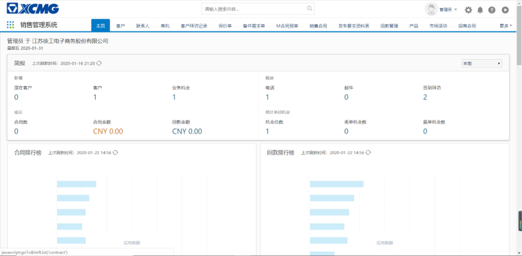
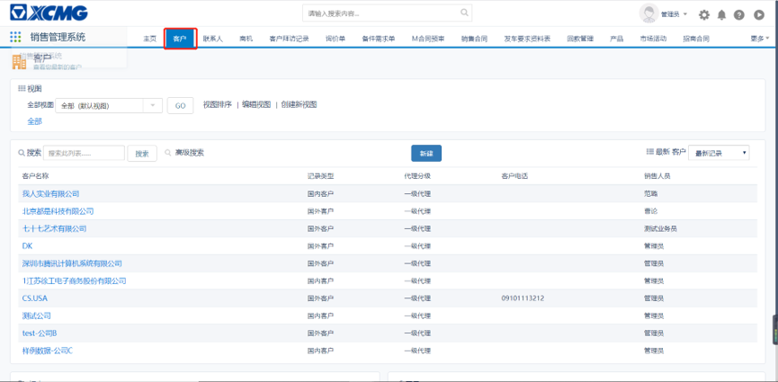
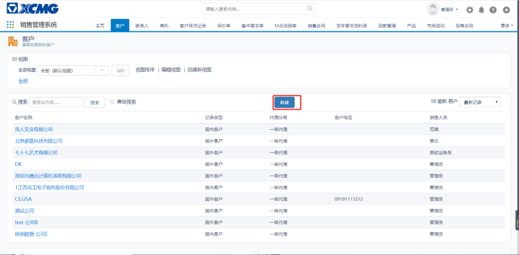
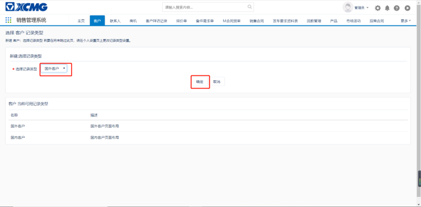
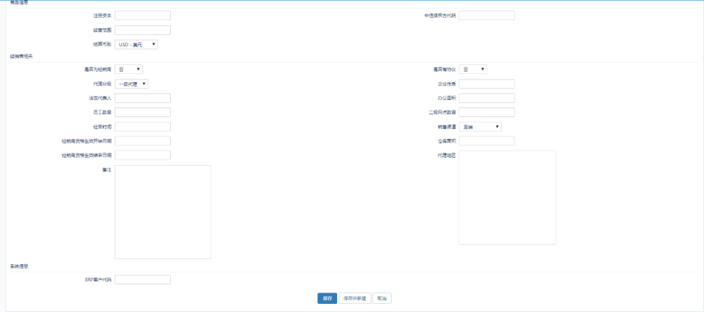

# 创建客户

使用账号登入CRM系统，进入到CRM系统主页。如下图所示：

点击‘客户’，进入到客户信息界面。如下图所示：

在客户界面上可查看到目前最新10条记录，可进行查看以及新建操作。点击新建按钮，新建一条新的客户数据。如下图所示：

点击新建之后，需要选择记录类型：国内客户或者国外客户。不同的记录类型所呈现的表单字段不一样，例如先建立国外客户，选择国外客户，点击确定按钮。如下图所示：

进入到客户信息新建页面，如下图所示：

:::tip
不带`*`号的字段为非必填项，带`*`号的字段为必填项，

国外客户必填项字段为：
- 客户信息来源：注：如果是通过螳螂网、machmall平台生成的客户数据，默认为螳螂网或者machmall
- 客户名称：附带天眼查功能，可根据天眼查带出公司信息，仅限于国内公司
- 客户分组：默认为境外集团外往来客商

国外客户特殊字段：
- 记录类型:此字段不可编辑，记录国内客户或者国外客户。
- 审批状态：此字段不可编辑，默认为草稿，单据保存后进行审批才能更新字段。
- 销售人员：此字段不可编辑，默认为登录人员账号名称
- 销售部门：此字段不可编辑，默认为登录人员账号部门
- 国家：默认为中国
- 结算币别：默认为USD-美元 
- 是否为经销商：如果选择‘是’，则审批提交到商务部审批；如果选择‘否’，则审批提交至窦凯审批。
- ERP客户编码：此字段不可查看（系统管理员除外），通过接口传输至ERP，ERP回传给CRM客户编码。
:::

国外客户特殊字段：
