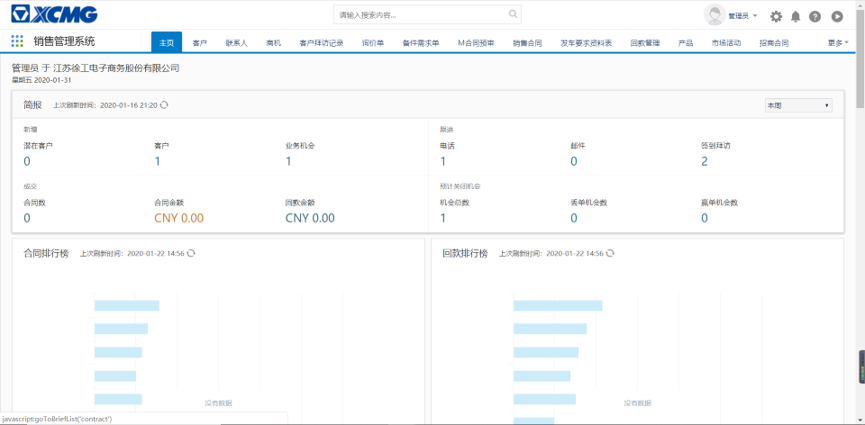

# 创建联系人

使用账号登入CRM系统，进入到CRM系统主页。如下图所示：

点击‘联系人’，进入到联系人信息界面。如下图所示：

在客户界面上可查看到目前最新10条记录，可进行查看以及新建操作。点击新建按钮，新建一条新的联系人数据。如下图所示：

进入到联系人信息新建页面，如下图所示：

:::tip
不带`*`号的字段为非必填项，带`*`号的字段为必填项

联系人必填项字段为：
- 姓：需要输入联系人的姓以便于查找
- 客户：即在客户菜单新建的客户，可以通过右边的查找进行查看。

新建完成之后直接 保存提交即可。