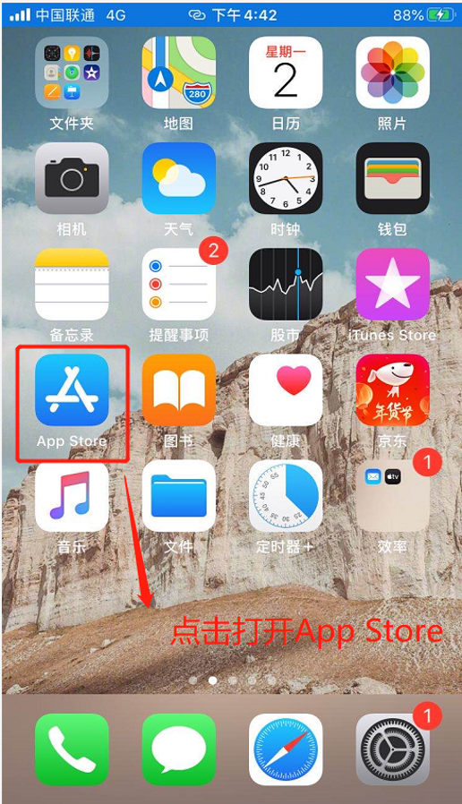
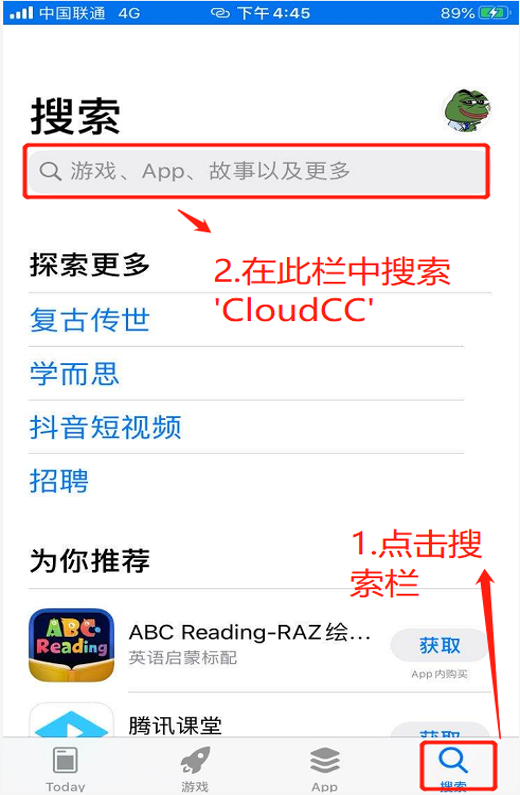
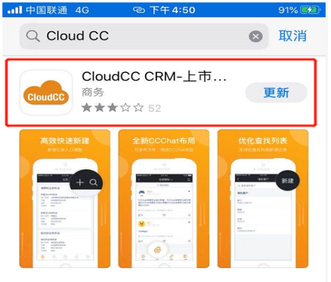
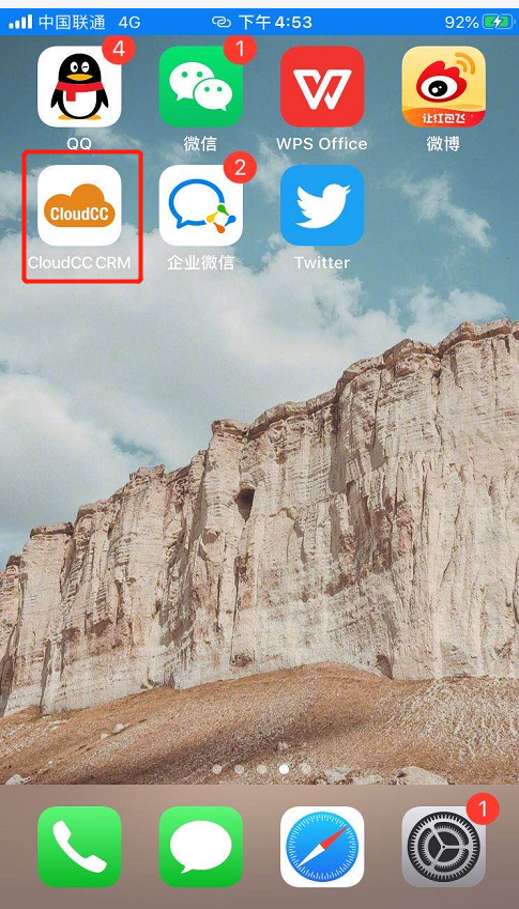
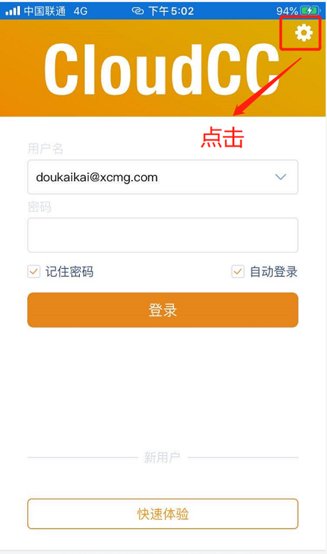
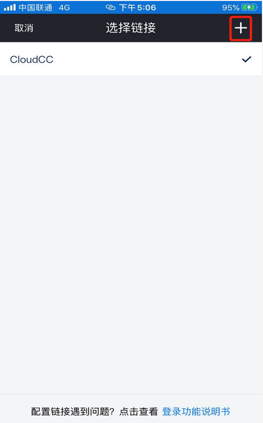
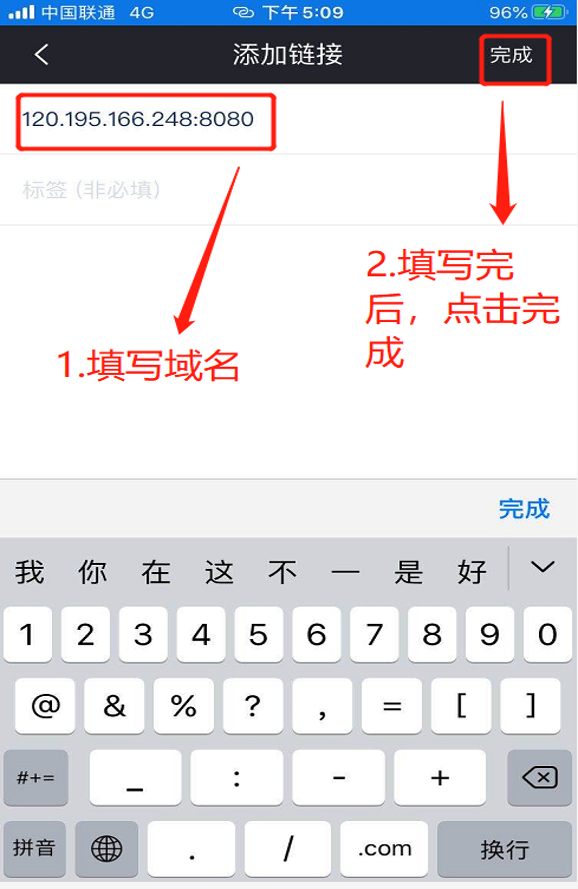
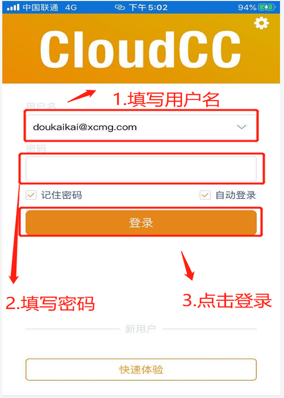

# 移动端

- 官方标准版提供 `IOS` 和 `Android` 版；
- 电商定制版仅有 `Android` 版。

## 官方标准版

### 步骤一：打开应用市场：

- `IOS`：打开苹果APP `APPLE STORE`，搜索`Cloud CC`
- `Android`：打开手机APP ‘应用市场’，搜索`Cloud CC`

- 以`IOS`手机为例，打开`App Store`

- 在搜索栏上方搜索 `CloudCC`，找到并点击下载

<!--  -->

- 下载之后，在手机桌面上可查看到`CloudCC CRM APP`

### 步骤二：设置地址

点击进入`CloudCC CRM`，点击右上方设置按钮，添加徐工电商外网域名。

输入外网地址120.195.166.248:8080，点击完成。

### 步骤三：登录APP

完成后跳回到登录页面，填写登录账号以及登录密码，并点击登录

## 徐工电商版

